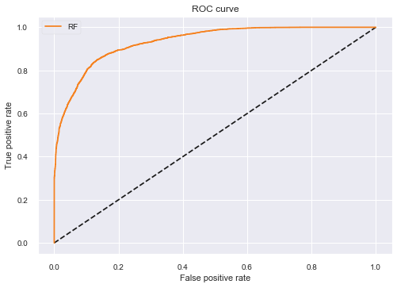
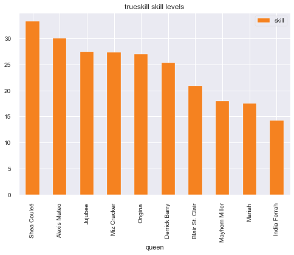

# Modeling Drag Race Skill Using TrueSkill
## Data
* Scraped from wikipedia results
* Unpivoted into quen-season-episode results 
* Numerically ranked
* Season-episode rematched into psudo-bouts

## Method
* prepare dataste
* iterate dataset applying trueskill while recording
    * pre match prediction as a representation of assumptions at the time
* predict against dataset using trained rankings as a representation of assumptions looking back 
* test accuracy 
    * shuffled ROC
    * shuffled confusion matrix

## Analysis 
* top queens
* biggest result upsets
    * upsets at the time
    * upsets in retrospective
* predict the results of season 5 allstars
    * vs matrix
    * raw skill plot

## Data Prep


```python
sdf = pd.read_csv("ass_dataset.csv")  # import allstarts drag race results
sdf = sdf[
    sdf["res1"] != sdf["res2"]
]  # did experement with including drawers, it reduces accuracy :(
sdf["rest"] = sdf["res1"]  # yep, I mislabled res in building_datasets
sdf["res1"] = sdf["res2"]
sdf["res2"] = sdf["rest"]
del sdf["rest"]
sdf["result"] = (sdf["res1"] < sdf["res2"]).astype(int)
sdf["s1"] = (sdf["res1"] < sdf["res2"]).astype(int)
sdf["s2"] = (sdf["res2"] < sdf["res1"]).astype(int)
```


```python
odf = pd.read_csv("open_dataset.csv")  # import normal drag race results
odf = odf[odf["res1"] != odf["res2"]]
odf["rest"] = odf["res1"]
odf["res1"] = odf["res2"]
odf["res2"] = odf["rest"]
del odf["rest"]
odf["result"] = (odf["res1"] < odf["res2"]).astype(int)
odf["s1"] = (odf["res1"] < odf["res2"]).astype(int)
odf["s2"] = (odf["res2"] < odf["res1"]).astype(int)
```


```python
odf = pd.concat([sdf, odf])
del odf["Unnamed: 0"]  # because I'm lazy and save with default indexes
```


```python
odf = odf.drop_duplicates()
```


```python
odf["season"] = [float(x.split(":")[0]) for x in odf["s:e"]]
odf["episode"] = [float(x.split(":")[1]) for x in odf["s:e"]]
```


```python
odf = odf.sort_values(["season", "episode"])
```


```python
odf.head()
```


<div>
<style scoped>
    .dataframe tbody tr th:only-of-type {
        vertical-align: middle;
    }

    .dataframe tbody tr th {
        vertical-align: top;
    }

    .dataframe thead th {
        text-align: right;
    }
</style>
<table border="1" class="dataframe">
  <thead>
    <tr style="text-align: right;">
      <th></th>
      <th>res1</th>
      <th>res2</th>
      <th>cont1</th>
      <th>cont2</th>
      <th>s:e</th>
      <th>position1</th>
      <th>position2</th>
      <th>sorted</th>
      <th>result</th>
      <th>s1</th>
      <th>s2</th>
      <th>season</th>
      <th>episode</th>
    </tr>
  </thead>
  <tbody>
    <tr>
      <th>0</th>
      <td>3.00000</td>
      <td>1.00000</td>
      <td>Bebe Zahara Benet</td>
      <td>Nina Flowers</td>
      <td>1:1</td>
      <td>SAFE</td>
      <td>WIN</td>
      <td>[['Bebe Zahara Benet', 'Nina Flowers'], '1:1']</td>
      <td>0</td>
      <td>0</td>
      <td>1</td>
      <td>1.00000</td>
      <td>1.00000</td>
    </tr>
    <tr>
      <th>282</th>
      <td>3.00000</td>
      <td>1.00000</td>
      <td>Tammie Brown</td>
      <td>Nina Flowers</td>
      <td>1:1</td>
      <td>SAFE</td>
      <td>WIN</td>
      <td>[['Nina Flowers', 'Tammie Brown'], '1:1']</td>
      <td>0</td>
      <td>0</td>
      <td>1</td>
      <td>1.00000</td>
      <td>1.00000</td>
    </tr>
    <tr>
      <th>284</th>
      <td>3.00000</td>
      <td>1.00000</td>
      <td>Shannel</td>
      <td>Nina Flowers</td>
      <td>1:1</td>
      <td>SAFE</td>
      <td>WIN</td>
      <td>[['Nina Flowers', 'Shannel'], '1:1']</td>
      <td>0</td>
      <td>0</td>
      <td>1</td>
      <td>1.00000</td>
      <td>1.00000</td>
    </tr>
    <tr>
      <th>298</th>
      <td>2.00000</td>
      <td>1.00000</td>
      <td>Ongina</td>
      <td>Nina Flowers</td>
      <td>1:1</td>
      <td>HIGH</td>
      <td>WIN</td>
      <td>[['Nina Flowers', 'Ongina'], '1:1']</td>
      <td>0</td>
      <td>0</td>
      <td>1</td>
      <td>1.00000</td>
      <td>1.00000</td>
    </tr>
    <tr>
      <th>309</th>
      <td>6.00000</td>
      <td>1.00000</td>
      <td>Victoria "Porkchop" Parker</td>
      <td>Nina Flowers</td>
      <td>1:1</td>
      <td>ELIM</td>
      <td>WIN</td>
      <td>[['Nina Flowers', 'Victoria "Porkchop" Parker'...</td>
      <td>0</td>
      <td>0</td>
      <td>1</td>
      <td>1.00000</td>
      <td>1.00000</td>
    </tr>
  </tbody>
</table>
</div>


## Trueskill training


```python
from trueskill import Rating, quality_1vs1, rate_1vs1
import trueskill
import itertools
import math
```


```python
# why isnt this implemented in trueskill?!
def win_probability(team1, team2):
    average_sigma = (team1[0].sigma + team2[0].sigma) / 2
    BETA = average_sigma / 2
    delta_mu = sum(r.mu for r in team1) - sum(r.mu for r in team2)
    sum_sigma = sum(r.sigma ** 2 for r in itertools.chain(team1, team2))
    size = len(team1) + len(team2)
    denom = math.sqrt(size * (BETA * BETA) + sum_sigma)
    ts = trueskill.global_env()
    return ts.cdf(delta_mu / denom)
```


```python
# build a dictionary of all queens
users = {
    x: Rating() for x in list(set(odf["cont1"].to_list() + odf["cont2"].to_list()))
}
```


```python
## train model
# iterate through every psudo-bout, update rankings accordingly

pre_game_predictions = []
r1 = []
r2 = []
for c1, c2, s1, s2 in zip(odf["cont1"], odf["cont2"], odf["res1"], odf["res2"]):

    # pre match recording
    #     print(users[c1], users[c2])
    r1.append(users[c1])
    r2.append(users[c2])

    # predicting
    prediction = win_probability([users[c1]], [users[c2]])
    pre_game_predictions.append(prediction)
    #     print(prediction)  # draw probability

    # results
    winner = [c1, c2][[s1, s2].index(min([s1, s2]))]  # find winner
    loser = [c1, c2][[s1, s2].index(max([s1, s2]))]
    #     print(winner, loser)
    drawn = s1 == s2  # check for a drawer
    new_r1, new_r2 = rate_1vs1(
        users[winner], users[loser], drawn=drawn
    )  # update rankings
    #     print(new_r1, new_r2)

    # post match updating
    users[winner] = new_r1
    users[loser] = new_r2

#     break
```


```python
post_training_predictions = []

for c1, c2, s1, s2 in zip(odf["cont1"], odf["cont2"], odf["res1"], odf["res2"]):
    prediction = win_probability([users[c1]], [users[c2]])
    post_training_predictions.append(prediction)
```

## Results and analyis 

### Training Data Accuracy


```python
import matplotlib.pyplot as plt
from pycm import *
from sklearn.metrics import roc_curve, classification_report
```


```python
odf["prediction"] = pre_game_predictions
odf["pt_preds"] = post_training_predictions
odf["binary_pred"] = (odf["prediction"] > 0.5).astype(int)
odf["pred_correct"] = (odf["binary_pred"] == odf["result"]).astype(int)
odf["r1"] = r1
odf["r2"] = r2
odf.head()
```


<div>
<style scoped>
    .dataframe tbody tr th:only-of-type {
        vertical-align: middle;
    }

    .dataframe tbody tr th {
        vertical-align: top;
    }

    .dataframe thead th {
        text-align: right;
    }
</style>
<table border="1" class="dataframe">
  <thead>
    <tr style="text-align: right;">
      <th></th>
      <th>res1</th>
      <th>res2</th>
      <th>cont1</th>
      <th>cont2</th>
      <th>s:e</th>
      <th>position1</th>
      <th>position2</th>
      <th>sorted</th>
      <th>result</th>
      <th>s1</th>
      <th>s2</th>
      <th>season</th>
      <th>episode</th>
      <th>prediction</th>
      <th>pt_preds</th>
      <th>binary_pred</th>
      <th>pred_correct</th>
      <th>r1</th>
      <th>r2</th>
    </tr>
  </thead>
  <tbody>
    <tr>
      <th>0</th>
      <td>3.00000</td>
      <td>1.00000</td>
      <td>Bebe Zahara Benet</td>
      <td>Nina Flowers</td>
      <td>1:1</td>
      <td>SAFE</td>
      <td>WIN</td>
      <td>[['Bebe Zahara Benet', 'Nina Flowers'], '1:1']</td>
      <td>0</td>
      <td>0</td>
      <td>1</td>
      <td>1.00000</td>
      <td>1.00000</td>
      <td>0.50000</td>
      <td>0.20325</td>
      <td>1</td>
      <td>0</td>
      <td>trueskill.Rating(mu=25.000, sigma=8.333)</td>
      <td>trueskill.Rating(mu=25.000, sigma=8.333)</td>
    </tr>
    <tr>
      <th>282</th>
      <td>3.00000</td>
      <td>1.00000</td>
      <td>Tammie Brown</td>
      <td>Nina Flowers</td>
      <td>1:1</td>
      <td>SAFE</td>
      <td>WIN</td>
      <td>[['Nina Flowers', 'Tammie Brown'], '1:1']</td>
      <td>0</td>
      <td>0</td>
      <td>1</td>
      <td>1.00000</td>
      <td>1.00000</td>
      <td>0.36024</td>
      <td>0.00000</td>
      <td>0</td>
      <td>1</td>
      <td>trueskill.Rating(mu=25.000, sigma=8.333)</td>
      <td>trueskill.Rating(mu=29.396, sigma=7.171)</td>
    </tr>
    <tr>
      <th>284</th>
      <td>3.00000</td>
      <td>1.00000</td>
      <td>Shannel</td>
      <td>Nina Flowers</td>
      <td>1:1</td>
      <td>SAFE</td>
      <td>WIN</td>
      <td>[['Nina Flowers', 'Shannel'], '1:1']</td>
      <td>0</td>
      <td>0</td>
      <td>1</td>
      <td>1.00000</td>
      <td>1.00000</td>
      <td>0.27727</td>
      <td>0.00008</td>
      <td>0</td>
      <td>1</td>
      <td>trueskill.Rating(mu=25.000, sigma=8.333)</td>
      <td>trueskill.Rating(mu=31.957, sigma=6.464)</td>
    </tr>
    <tr>
      <th>298</th>
      <td>2.00000</td>
      <td>1.00000</td>
      <td>Ongina</td>
      <td>Nina Flowers</td>
      <td>1:1</td>
      <td>HIGH</td>
      <td>WIN</td>
      <td>[['Nina Flowers', 'Ongina'], '1:1']</td>
      <td>0</td>
      <td>0</td>
      <td>1</td>
      <td>1.00000</td>
      <td>1.00000</td>
      <td>0.22354</td>
      <td>0.00074</td>
      <td>0</td>
      <td>1</td>
      <td>trueskill.Rating(mu=25.000, sigma=8.333)</td>
      <td>trueskill.Rating(mu=33.693, sigma=5.974)</td>
    </tr>
    <tr>
      <th>309</th>
      <td>6.00000</td>
      <td>1.00000</td>
      <td>Victoria "Porkchop" Parker</td>
      <td>Nina Flowers</td>
      <td>1:1</td>
      <td>ELIM</td>
      <td>WIN</td>
      <td>[['Nina Flowers', 'Victoria "Porkchop" Parker'...</td>
      <td>0</td>
      <td>0</td>
      <td>1</td>
      <td>1.00000</td>
      <td>1.00000</td>
      <td>0.18634</td>
      <td>0.00000</td>
      <td>0</td>
      <td>1</td>
      <td>trueskill.Rating(mu=25.000, sigma=8.333)</td>
      <td>trueskill.Rating(mu=34.974, sigma=5.608)</td>
    </tr>
  </tbody>
</table>
</div>


```python
rand = [np.random.randint(2) for x in range(len(odf))]
y = [x + r for x, r in zip(odf["result"], rand)]
y_pred = [abs(r - x) for x, r in zip(odf["prediction"], rand)]
y_int = [int(x > 0.5) for x in y_pred]
```


```python
# calculate confusion matrix using https://www.pycm.ir/doc/index.html#Usage
cm = ConfusionMatrix(y, y_int)
print(cm)
```

    Predict    0          1          
    Actual
    0          3993       681        
    
    1          669        4043       
    
    
    
    
    
    Overall Statistics : 
    
    95% CI                                                            (0.84907,0.86327)
    ACC Macro                                                         0.85617
    AUNP                                                              0.85616
    AUNU                                                              0.85616
    Bennett S                                                         0.71234
    CBA                                                               0.85507
    CSI                                                               0.71233
    Chi-Squared                                                       4762.61695
    Chi-Squared DF                                                    1
    Conditional Entropy                                               0.59416
    Cramer V                                                          0.71233
    Cross Entropy                                                     0.99999
    F1 Macro                                                          0.85616
    F1 Micro                                                          0.85617
    Gwet AC1                                                          0.71235
    Hamming Loss                                                      0.14383
    Joint Entropy                                                     1.59415
    KL Divergence                                                     0.0
    Kappa                                                             0.71233
    Kappa 95% CI                                                      (0.69813,0.72653)
    Kappa No Prevalence                                               0.71234
    Kappa Standard Error                                              0.00724
    Kappa Unbiased                                                    0.71233
    Lambda A                                                          0.71117
    Lambda B                                                          0.71042
    Mutual Information                                                0.4058
    NIR                                                               0.50202
    Overall ACC                                                       0.85617
    Overall CEN                                                       0.5462
    Overall J                                                         (1.49701,0.7485)
    Overall MCC                                                       0.71233
    Overall MCEN                                                      0.43025
    Overall RACC                                                      0.50001
    Overall RACCU                                                     0.50001
    P-Value                                                           None
    PPV Macro                                                         0.85617
    PPV Micro                                                         0.85617
    Pearson C                                                         0.58018
    Phi-Squared                                                       0.50742
    RCI                                                               0.40581
    RR                                                                4693.0
    Reference Entropy                                                 0.99999
    Response Entropy                                                  0.99997
    SOA1(Landis & Koch)                                               Substantial
    SOA2(Fleiss)                                                      Intermediate to Good
    SOA3(Altman)                                                      Good
    SOA4(Cicchetti)                                                   Good
    SOA5(Cramer)                                                      Strong
    SOA6(Matthews)                                                    Strong
    Scott PI                                                          0.71233
    Standard Error                                                    0.00362
    TPR Macro                                                         0.85616
    TPR Micro                                                         0.85617
    Zero-one Loss                                                     1350
    
    Class Statistics :
    
    Classes                                                           0             1             
    ACC(Accuracy)                                                     0.85617       0.85617       
    AGF(Adjusted F-score)                                             0.85551       0.85682       
    AGM(Adjusted geometric mean)                                      0.85678       0.85554       
    AM(Difference between automatic and manual classification)        -12           12            
    AUC(Area under the ROC curve)                                     0.85616       0.85616       
    AUCI(AUC value interpretation)                                    Very Good     Very Good     
    AUPR(Area under the PR curve)                                     0.8554        0.85693       
    BCD(Bray-Curtis dissimilarity)                                    0.00064       0.00064       
    BM(Informedness or bookmaker informedness)                        0.71232       0.71232       
    CEN(Confusion entropy)                                            0.54801       0.5444        
    DOR(Diagnostic odds ratio)                                        35.43479      35.43479      
    DP(Discriminant power)                                            0.85425       0.85425       
    DPI(Discriminant power interpretation)                            Poor          Poor          
    ERR(Error rate)                                                   0.14383       0.14383       
    F0.5(F0.5 score)                                                  0.85606       0.85628       
    F1(F1 score - harmonic mean of precision and sensitivity)         0.8554        0.85693       
    F2(F2 score)                                                      0.85474       0.85759       
    FDR(False discovery rate)                                         0.1435        0.14416       
    FN(False negative/miss/type 2 error)                              681           669           
    FNR(Miss rate or false negative rate)                             0.1457        0.14198       
    FOR(False omission rate)                                          0.14416       0.1435        
    FP(False positive/type 1 error/false alarm)                       669           681           
    FPR(Fall-out or false positive rate)                              0.14198       0.1457        
    G(G-measure geometric mean of precision and sensitivity)          0.8554        0.85693       
    GI(Gini index)                                                    0.71232       0.71232       
    GM(G-mean geometric mean of specificity and sensitivity)          0.85616       0.85616       
    IBA(Index of balanced accuracy)                                   0.73028       0.73574       
    ICSI(Individual classification success index)                     0.7108        0.71386       
    IS(Information score)                                             0.78238       0.76959       
    J(Jaccard index)                                                  0.74733       0.74968       
    LS(Lift score)                                                    1.71996       1.70478       
    MCC(Matthews correlation coefficient)                             0.71233       0.71233       
    MCCI(Matthews correlation coefficient interpretation)             Strong        Strong        
    MCEN(Modified confusion entropy)                                  0.75412       0.75049       
    MK(Markedness)                                                    0.71234       0.71234       
    N(Condition negative)                                             4712          4674          
    NLR(Negative likelihood ratio)                                    0.16981       0.16619       
    NLRI(Negative likelihood ratio interpretation)                    Fair          Fair          
    NPV(Negative predictive value)                                    0.85584       0.8565        
    OC(Overlap coefficient)                                           0.8565        0.85802       
    OOC(Otsuka-Ochiai coefficient)                                    0.8554        0.85693       
    OP(Optimized precision)                                           0.854         0.854         
    P(Condition positive or support)                                  4674          4712          
    PLR(Positive likelihood ratio)                                    6.01714       5.88898       
    PLRI(Positive likelihood ratio interpretation)                    Fair          Fair          
    POP(Population)                                                   9386          9386          
    PPV(Precision or positive predictive value)                       0.8565        0.85584       
    PRE(Prevalence)                                                   0.49798       0.50202       
    Q(Yule Q - coefficient of colligation)                            0.94511       0.94511       
    RACC(Random accuracy)                                             0.24734       0.25267       
    RACCU(Random accuracy unbiased)                                   0.24734       0.25267       
    TN(True negative/correct rejection)                               4043          3993          
    TNR(Specificity or true negative rate)                            0.85802       0.8543        
    TON(Test outcome negative)                                        4724          4662          
    TOP(Test outcome positive)                                        4662          4724          
    TP(True positive/hit)                                             3993          4043          
    TPR(Sensitivity, recall, hit rate, or true positive rate)         0.8543        0.85802       
    Y(Youden index)                                                   0.71232       0.71232       
    dInd(Distance index)                                              0.20344       0.20344       
    sInd(Similarity index)                                            0.85615       0.85615       
    
    


```python
# build ROC curve (closer to top left is better)
fpr_rf, tpr_rf, _ = roc_curve(y, y_pred)
plt.figure(1)
plt.plot([0, 1], [0, 1], "k--")
plt.plot(fpr_rf, tpr_rf, label="RF")
plt.xlabel("False positive rate")
plt.ylabel("True positive rate")
plt.title("ROC curve")
plt.legend(loc="best")
plt.show()
```





### Overall rankings


```python
## top queens
# full results are in trueskill_summary.csv
summary = pd.DataFrame(users).T
summary.columns = ["rating", "uncertainty"]
summary = summary.sort_values("rating", ascending=False)
summary.head(15)
```


<div>
<style scoped>
    .dataframe tbody tr th:only-of-type {
        vertical-align: middle;
    }

    .dataframe tbody tr th {
        vertical-align: top;
    }

    .dataframe thead th {
        text-align: right;
    }
</style>
<table border="1" class="dataframe">
  <thead>
    <tr style="text-align: right;">
      <th></th>
      <th>rating</th>
      <th>uncertainty</th>
    </tr>
  </thead>
  <tbody>
    <tr>
      <th>Jinkx Monsoon</th>
      <td>35.02682</td>
      <td>1.12313</td>
    </tr>
    <tr>
      <th>Shea Couleé</th>
      <td>33.31276</td>
      <td>1.10195</td>
    </tr>
    <tr>
      <th>Sasha Velour</th>
      <td>33.19470</td>
      <td>1.03827</td>
    </tr>
    <tr>
      <th>Nina Flowers</th>
      <td>33.09661</td>
      <td>1.21995</td>
    </tr>
    <tr>
      <th>Alaska</th>
      <td>32.56031</td>
      <td>1.03196</td>
    </tr>
    <tr>
      <th>Sharon Needles</th>
      <td>32.53998</td>
      <td>1.06765</td>
    </tr>
    <tr>
      <th>Chad Michaels</th>
      <td>32.50983</td>
      <td>1.11961</td>
    </tr>
    <tr>
      <th>Bob the Drag Queen</th>
      <td>32.02848</td>
      <td>1.17629</td>
    </tr>
    <tr>
      <th>Roxxxy Andrews</th>
      <td>32.00112</td>
      <td>1.01420</td>
    </tr>
    <tr>
      <th>Raja</th>
      <td>31.86649</td>
      <td>0.96499</td>
    </tr>
    <tr>
      <th>Manila Luzon</th>
      <td>31.75304</td>
      <td>0.95626</td>
    </tr>
    <tr>
      <th>Bebe Zahara Benet</th>
      <td>31.54853</td>
      <td>1.13799</td>
    </tr>
    <tr>
      <th>Tyra Sanchez</th>
      <td>31.46620</td>
      <td>1.00883</td>
    </tr>
    <tr>
      <th>Ginger Minj</th>
      <td>31.37182</td>
      <td>1.02316</td>
    </tr>
    <tr>
      <th>Bianca Del Rio</th>
      <td>31.29072</td>
      <td>1.06665</td>
    </tr>
  </tbody>
</table>
</div>


### biggest upsets at the time


```python
# based on the pre-match predictions
odf.dropna().sort_values("prediction", ascending=False)[
    ["cont1", "cont2", "position1", "position2", "prediction", "s:e"]
].head(10)
```


<div>
<style scoped>
    .dataframe tbody tr th:only-of-type {
        vertical-align: middle;
    }

    .dataframe tbody tr th {
        vertical-align: top;
    }

    .dataframe thead th {
        text-align: right;
    }
</style>
<table border="1" class="dataframe">
  <thead>
    <tr style="text-align: right;">
      <th></th>
      <th>cont1</th>
      <th>cont2</th>
      <th>position1</th>
      <th>position2</th>
      <th>prediction</th>
      <th>s:e</th>
    </tr>
  </thead>
  <tbody>
    <tr>
      <th>4</th>
      <td>Morgan McMichaels</td>
      <td>Sahara Davenport</td>
      <td>SAFE</td>
      <td>WIN</td>
      <td>1.00000</td>
      <td>2:2</td>
    </tr>
    <tr>
      <th>462</th>
      <td>Alexis Mateo</td>
      <td>Delta Work</td>
      <td>BTM2</td>
      <td>HIGH</td>
      <td>1.00000</td>
      <td>3:7</td>
    </tr>
    <tr>
      <th>822</th>
      <td>Mimi Imfurst</td>
      <td>Delta Work</td>
      <td>ELIM</td>
      <td>SAFE</td>
      <td>1.00000</td>
      <td>3:4</td>
    </tr>
    <tr>
      <th>371</th>
      <td>Tyra Sanchez</td>
      <td>Raven</td>
      <td>LOW</td>
      <td>HIGH</td>
      <td>1.00000</td>
      <td>2:6</td>
    </tr>
    <tr>
      <th>4925</th>
      <td>Thorgy Thor</td>
      <td>Cynthia Lee Fontaine</td>
      <td>Guest</td>
      <td>Miss C</td>
      <td>1.00000</td>
      <td>8:10.0</td>
    </tr>
    <tr>
      <th>4913</th>
      <td>Derrick Barry</td>
      <td>Cynthia Lee Fontaine</td>
      <td>Guest</td>
      <td>Miss C</td>
      <td>1.00000</td>
      <td>8:10.0</td>
    </tr>
    <tr>
      <th>4943</th>
      <td>Chi Chi DeVayne</td>
      <td>Cynthia Lee Fontaine</td>
      <td>Guest</td>
      <td>Miss C</td>
      <td>1.00000</td>
      <td>8:10.0</td>
    </tr>
    <tr>
      <th>400</th>
      <td>Morgan McMichaels</td>
      <td>Mystique Summers Madison</td>
      <td>SAFE</td>
      <td>HIGH</td>
      <td>1.00000</td>
      <td>2:2</td>
    </tr>
    <tr>
      <th>5591</th>
      <td>Trinity Taylor</td>
      <td>Cynthia Lee Fontaine</td>
      <td>BTM2</td>
      <td>SAFE</td>
      <td>1.00000</td>
      <td>9:4.0</td>
    </tr>
    <tr>
      <th>87</th>
      <td>Ongina</td>
      <td>Rebecca Glasscock</td>
      <td>ELIM</td>
      <td>WIN</td>
      <td>1.00000</td>
      <td>1:5</td>
    </tr>
  </tbody>
</table>
</div>


### biggest upsets in retrospective


```python
# based on the fully trained model
odf.dropna().sort_values("pt_preds", ascending=False)[
    ["cont1", "cont2", "position1", "position2", "prediction", "s:e"]
].head(10)
```


<div>
<style scoped>
    .dataframe tbody tr th:only-of-type {
        vertical-align: middle;
    }

    .dataframe tbody tr th {
        vertical-align: top;
    }

    .dataframe thead th {
        text-align: right;
    }
</style>
<table border="1" class="dataframe">
  <thead>
    <tr style="text-align: right;">
      <th></th>
      <th>cont1</th>
      <th>cont2</th>
      <th>position1</th>
      <th>position2</th>
      <th>prediction</th>
      <th>s:e</th>
    </tr>
  </thead>
  <tbody>
    <tr>
      <th>3785</th>
      <td>Yara Sofia</td>
      <td>Mimi Imfurst</td>
      <td>SAFE</td>
      <td>HIGH</td>
      <td>0.02396</td>
      <td>3:2.0</td>
    </tr>
    <tr>
      <th>4130</th>
      <td>Manila Luzon</td>
      <td>Mariah</td>
      <td>SAFE</td>
      <td>HIGH</td>
      <td>0.33951</td>
      <td>3:3.0</td>
    </tr>
    <tr>
      <th>6833</th>
      <td>Raven</td>
      <td>Sonique</td>
      <td>BTM2</td>
      <td>LOW</td>
      <td>0.52736</td>
      <td>2:2.0</td>
    </tr>
    <tr>
      <th>548</th>
      <td>Alexis Mateo</td>
      <td>Mimi Imfurst</td>
      <td>SAFE</td>
      <td>HIGH</td>
      <td>0.17500</td>
      <td>3:2</td>
    </tr>
    <tr>
      <th>4004</th>
      <td>A'Keria Chanel Davenport</td>
      <td>Mercedes Iman Diamond</td>
      <td>BTM6</td>
      <td>HIGH</td>
      <td>0.99981</td>
      <td>11:3.0</td>
    </tr>
    <tr>
      <th>6727</th>
      <td>Brooke Lynn Hytes</td>
      <td>Honey Davenport</td>
      <td>LOW</td>
      <td>SAFE</td>
      <td>0.73222</td>
      <td>11:2.0</td>
    </tr>
    <tr>
      <th>3759</th>
      <td>Raven</td>
      <td>Mystique Summers Madison</td>
      <td>BTM2</td>
      <td>HIGH</td>
      <td>0.10837</td>
      <td>2:2.0</td>
    </tr>
    <tr>
      <th>3437</th>
      <td>Aquaria</td>
      <td>Yuhua Hamasaki</td>
      <td>SAFE</td>
      <td>HIGH</td>
      <td>0.04422</td>
      <td>10:1.0</td>
    </tr>
    <tr>
      <th>4123</th>
      <td>Manila Luzon</td>
      <td>Mimi Imfurst</td>
      <td>SAFE</td>
      <td>HIGH</td>
      <td>0.04435</td>
      <td>3:3.0</td>
    </tr>
    <tr>
      <th>4666</th>
      <td>Shangela</td>
      <td>Phoenix</td>
      <td>BTM2</td>
      <td>SAFE</td>
      <td>0.01769</td>
      <td>3:2.0</td>
    </tr>
  </tbody>
</table>
</div>


### Season 5 results prediction


```python
season_5_queens = [
    "Alexis Mateo",
    "Blair St. Clair",
    "Derrick Barry",
    "India Ferrah",
    "Jujubee",
    "Mariah",
    "Mayhem Miller",
    "Miz Cracker",
    "Ongina",
    "Shea Couleé",
]
as5_1 = []
as5_2 = []
pred = []
for x in season_5_queens:
    for y in season_5_queens:
        as5_1.append(x)
        as5_2.append(y)
        pred.append(win_probability([users[x]], [users[y]]))

season_5_res = pd.DataFrame({"as5_1": as5_1, "as5_2": as5_2, "win_prediction": pred})
season_5_res = season_5_res.pivot(
    index="as5_1", columns="as5_2", values="win_prediction"
)
season_5_res["mean"] = season_5_res.mean(axis=1)
season_5_res = season_5_res.sort_values("mean", ascending=False)
del season_5_res["mean"]
print("Interpreted as probability that queen on the side beats the queen along top.")
print("e.g. Shea has a 0.978 liklihood to get a result higher than Alexis")
season_5_res[season_5_res.index].round(3).style.background_gradient("Blues")
```

    Interpreted as probability that queen on the side beats the queen along top.
    e.g. Shea has a 0.978 liklihood to get a result higher than Alexis
    


<style  type="text/css" >
    #T_f8937218_9e89_11ea_9148_a0a4c579d460row0_col0 {
            background-color:  #08306b;
            color:  #f1f1f1;
        }    #T_f8937218_9e89_11ea_9148_a0a4c579d460row0_col1 {
            background-color:  #08306b;
            color:  #f1f1f1;
        }    #T_f8937218_9e89_11ea_9148_a0a4c579d460row0_col2 {
            background-color:  #08306b;
            color:  #f1f1f1;
        }    #T_f8937218_9e89_11ea_9148_a0a4c579d460row0_col3 {
            background-color:  #08306b;
            color:  #f1f1f1;
        }    #T_f8937218_9e89_11ea_9148_a0a4c579d460row0_col4 {
            background-color:  #08306b;
            color:  #f1f1f1;
        }    #T_f8937218_9e89_11ea_9148_a0a4c579d460row0_col5 {
            background-color:  #08306b;
            color:  #f1f1f1;
        }    #T_f8937218_9e89_11ea_9148_a0a4c579d460row0_col6 {
            background-color:  #08306b;
            color:  #f1f1f1;
        }    #T_f8937218_9e89_11ea_9148_a0a4c579d460row0_col7 {
            background-color:  #08306b;
            color:  #f1f1f1;
        }    #T_f8937218_9e89_11ea_9148_a0a4c579d460row0_col8 {
            background-color:  #08306b;
            color:  #f1f1f1;
        }    #T_f8937218_9e89_11ea_9148_a0a4c579d460row0_col9 {
            background-color:  #08306b;
            color:  #f1f1f1;
        }    #T_f8937218_9e89_11ea_9148_a0a4c579d460row1_col0 {
            background-color:  #eef5fc;
            color:  #000000;
        }    #T_f8937218_9e89_11ea_9148_a0a4c579d460row1_col1 {
            background-color:  #68acd5;
            color:  #000000;
        }    #T_f8937218_9e89_11ea_9148_a0a4c579d460row1_col2 {
            background-color:  #083a7a;
            color:  #f1f1f1;
        }    #T_f8937218_9e89_11ea_9148_a0a4c579d460row1_col3 {
            background-color:  #083979;
            color:  #f1f1f1;
        }    #T_f8937218_9e89_11ea_9148_a0a4c579d460row1_col4 {
            background-color:  #083979;
            color:  #f1f1f1;
        }    #T_f8937218_9e89_11ea_9148_a0a4c579d460row1_col5 {
            background-color:  #08306b;
            color:  #f1f1f1;
        }    #T_f8937218_9e89_11ea_9148_a0a4c579d460row1_col6 {
            background-color:  #08306b;
            color:  #f1f1f1;
        }    #T_f8937218_9e89_11ea_9148_a0a4c579d460row1_col7 {
            background-color:  #08306b;
            color:  #f1f1f1;
        }    #T_f8937218_9e89_11ea_9148_a0a4c579d460row1_col8 {
            background-color:  #08306b;
            color:  #f1f1f1;
        }    #T_f8937218_9e89_11ea_9148_a0a4c579d460row1_col9 {
            background-color:  #08306b;
            color:  #f1f1f1;
        }    #T_f8937218_9e89_11ea_9148_a0a4c579d460row2_col0 {
            background-color:  #f7fbff;
            color:  #000000;
        }    #T_f8937218_9e89_11ea_9148_a0a4c579d460row2_col1 {
            background-color:  #eff6fc;
            color:  #000000;
        }    #T_f8937218_9e89_11ea_9148_a0a4c579d460row2_col2 {
            background-color:  #6aaed6;
            color:  #000000;
        }    #T_f8937218_9e89_11ea_9148_a0a4c579d460row2_col3 {
            background-color:  #5da5d1;
            color:  #000000;
        }    #T_f8937218_9e89_11ea_9148_a0a4c579d460row2_col4 {
            background-color:  #4292c6;
            color:  #000000;
        }    #T_f8937218_9e89_11ea_9148_a0a4c579d460row2_col5 {
            background-color:  #08488e;
            color:  #f1f1f1;
        }    #T_f8937218_9e89_11ea_9148_a0a4c579d460row2_col6 {
            background-color:  #08306b;
            color:  #f1f1f1;
        }    #T_f8937218_9e89_11ea_9148_a0a4c579d460row2_col7 {
            background-color:  #08306b;
            color:  #f1f1f1;
        }    #T_f8937218_9e89_11ea_9148_a0a4c579d460row2_col8 {
            background-color:  #08306b;
            color:  #f1f1f1;
        }    #T_f8937218_9e89_11ea_9148_a0a4c579d460row2_col9 {
            background-color:  #08306b;
            color:  #f1f1f1;
        }    #T_f8937218_9e89_11ea_9148_a0a4c579d460row3_col0 {
            background-color:  #f7fbff;
            color:  #000000;
        }    #T_f8937218_9e89_11ea_9148_a0a4c579d460row3_col1 {
            background-color:  #f0f6fd;
            color:  #000000;
        }    #T_f8937218_9e89_11ea_9148_a0a4c579d460row3_col2 {
            background-color:  #7cb7da;
            color:  #000000;
        }    #T_f8937218_9e89_11ea_9148_a0a4c579d460row3_col3 {
            background-color:  #6aaed6;
            color:  #000000;
        }    #T_f8937218_9e89_11ea_9148_a0a4c579d460row3_col4 {
            background-color:  #4e9acb;
            color:  #000000;
        }    #T_f8937218_9e89_11ea_9148_a0a4c579d460row3_col5 {
            background-color:  #084e98;
            color:  #f1f1f1;
        }    #T_f8937218_9e89_11ea_9148_a0a4c579d460row3_col6 {
            background-color:  #08306b;
            color:  #f1f1f1;
        }    #T_f8937218_9e89_11ea_9148_a0a4c579d460row3_col7 {
            background-color:  #08306b;
            color:  #f1f1f1;
        }    #T_f8937218_9e89_11ea_9148_a0a4c579d460row3_col8 {
            background-color:  #08306b;
            color:  #f1f1f1;
        }    #T_f8937218_9e89_11ea_9148_a0a4c579d460row3_col9 {
            background-color:  #08306b;
            color:  #f1f1f1;
        }    #T_f8937218_9e89_11ea_9148_a0a4c579d460row4_col0 {
            background-color:  #f7fbff;
            color:  #000000;
        }    #T_f8937218_9e89_11ea_9148_a0a4c579d460row4_col1 {
            background-color:  #f0f6fd;
            color:  #000000;
        }    #T_f8937218_9e89_11ea_9148_a0a4c579d460row4_col2 {
            background-color:  #9dcae1;
            color:  #000000;
        }    #T_f8937218_9e89_11ea_9148_a0a4c579d460row4_col3 {
            background-color:  #8fc2de;
            color:  #000000;
        }    #T_f8937218_9e89_11ea_9148_a0a4c579d460row4_col4 {
            background-color:  #6aaed6;
            color:  #000000;
        }    #T_f8937218_9e89_11ea_9148_a0a4c579d460row4_col5 {
            background-color:  #1562a9;
            color:  #f1f1f1;
        }    #T_f8937218_9e89_11ea_9148_a0a4c579d460row4_col6 {
            background-color:  #08306b;
            color:  #f1f1f1;
        }    #T_f8937218_9e89_11ea_9148_a0a4c579d460row4_col7 {
            background-color:  #08306b;
            color:  #f1f1f1;
        }    #T_f8937218_9e89_11ea_9148_a0a4c579d460row4_col8 {
            background-color:  #08306b;
            color:  #f1f1f1;
        }    #T_f8937218_9e89_11ea_9148_a0a4c579d460row4_col9 {
            background-color:  #08306b;
            color:  #f1f1f1;
        }    #T_f8937218_9e89_11ea_9148_a0a4c579d460row5_col0 {
            background-color:  #f7fbff;
            color:  #000000;
        }    #T_f8937218_9e89_11ea_9148_a0a4c579d460row5_col1 {
            background-color:  #f7fbff;
            color:  #000000;
        }    #T_f8937218_9e89_11ea_9148_a0a4c579d460row5_col2 {
            background-color:  #e5eff9;
            color:  #000000;
        }    #T_f8937218_9e89_11ea_9148_a0a4c579d460row5_col3 {
            background-color:  #e0ecf8;
            color:  #000000;
        }    #T_f8937218_9e89_11ea_9148_a0a4c579d460row5_col4 {
            background-color:  #d1e2f3;
            color:  #000000;
        }    #T_f8937218_9e89_11ea_9148_a0a4c579d460row5_col5 {
            background-color:  #6aaed6;
            color:  #000000;
        }    #T_f8937218_9e89_11ea_9148_a0a4c579d460row5_col6 {
            background-color:  #08316d;
            color:  #f1f1f1;
        }    #T_f8937218_9e89_11ea_9148_a0a4c579d460row5_col7 {
            background-color:  #08306b;
            color:  #f1f1f1;
        }    #T_f8937218_9e89_11ea_9148_a0a4c579d460row5_col8 {
            background-color:  #08306b;
            color:  #f1f1f1;
        }    #T_f8937218_9e89_11ea_9148_a0a4c579d460row5_col9 {
            background-color:  #08306b;
            color:  #f1f1f1;
        }    #T_f8937218_9e89_11ea_9148_a0a4c579d460row6_col0 {
            background-color:  #f7fbff;
            color:  #000000;
        }    #T_f8937218_9e89_11ea_9148_a0a4c579d460row6_col1 {
            background-color:  #f7fbff;
            color:  #000000;
        }    #T_f8937218_9e89_11ea_9148_a0a4c579d460row6_col2 {
            background-color:  #f7fbff;
            color:  #000000;
        }    #T_f8937218_9e89_11ea_9148_a0a4c579d460row6_col3 {
            background-color:  #f7fbff;
            color:  #000000;
        }    #T_f8937218_9e89_11ea_9148_a0a4c579d460row6_col4 {
            background-color:  #f7fbff;
            color:  #000000;
        }    #T_f8937218_9e89_11ea_9148_a0a4c579d460row6_col5 {
            background-color:  #f6faff;
            color:  #000000;
        }    #T_f8937218_9e89_11ea_9148_a0a4c579d460row6_col6 {
            background-color:  #6aaed6;
            color:  #000000;
        }    #T_f8937218_9e89_11ea_9148_a0a4c579d460row6_col7 {
            background-color:  #083a7a;
            color:  #f1f1f1;
        }    #T_f8937218_9e89_11ea_9148_a0a4c579d460row6_col8 {
            background-color:  #083471;
            color:  #f1f1f1;
        }    #T_f8937218_9e89_11ea_9148_a0a4c579d460row6_col9 {
            background-color:  #08306b;
            color:  #f1f1f1;
        }    #T_f8937218_9e89_11ea_9148_a0a4c579d460row7_col0 {
            background-color:  #f7fbff;
            color:  #000000;
        }    #T_f8937218_9e89_11ea_9148_a0a4c579d460row7_col1 {
            background-color:  #f7fbff;
            color:  #000000;
        }    #T_f8937218_9e89_11ea_9148_a0a4c579d460row7_col2 {
            background-color:  #f7fbff;
            color:  #000000;
        }    #T_f8937218_9e89_11ea_9148_a0a4c579d460row7_col3 {
            background-color:  #f7fbff;
            color:  #000000;
        }    #T_f8937218_9e89_11ea_9148_a0a4c579d460row7_col4 {
            background-color:  #f7fbff;
            color:  #000000;
        }    #T_f8937218_9e89_11ea_9148_a0a4c579d460row7_col5 {
            background-color:  #f7fbff;
            color:  #000000;
        }    #T_f8937218_9e89_11ea_9148_a0a4c579d460row7_col6 {
            background-color:  #eff6fc;
            color:  #000000;
        }    #T_f8937218_9e89_11ea_9148_a0a4c579d460row7_col7 {
            background-color:  #6fb0d7;
            color:  #000000;
        }    #T_f8937218_9e89_11ea_9148_a0a4c579d460row7_col8 {
            background-color:  #4997c9;
            color:  #000000;
        }    #T_f8937218_9e89_11ea_9148_a0a4c579d460row7_col9 {
            background-color:  #083a7a;
            color:  #f1f1f1;
        }    #T_f8937218_9e89_11ea_9148_a0a4c579d460row8_col0 {
            background-color:  #f7fbff;
            color:  #000000;
        }    #T_f8937218_9e89_11ea_9148_a0a4c579d460row8_col1 {
            background-color:  #f7fbff;
            color:  #000000;
        }    #T_f8937218_9e89_11ea_9148_a0a4c579d460row8_col2 {
            background-color:  #f7fbff;
            color:  #000000;
        }    #T_f8937218_9e89_11ea_9148_a0a4c579d460row8_col3 {
            background-color:  #f7fbff;
            color:  #000000;
        }    #T_f8937218_9e89_11ea_9148_a0a4c579d460row8_col4 {
            background-color:  #f7fbff;
            color:  #000000;
        }    #T_f8937218_9e89_11ea_9148_a0a4c579d460row8_col5 {
            background-color:  #f7fbff;
            color:  #000000;
        }    #T_f8937218_9e89_11ea_9148_a0a4c579d460row8_col6 {
            background-color:  #f4f9fe;
            color:  #000000;
        }    #T_f8937218_9e89_11ea_9148_a0a4c579d460row8_col7 {
            background-color:  #a0cbe2;
            color:  #000000;
        }    #T_f8937218_9e89_11ea_9148_a0a4c579d460row8_col8 {
            background-color:  #72b2d8;
            color:  #000000;
        }    #T_f8937218_9e89_11ea_9148_a0a4c579d460row8_col9 {
            background-color:  #084387;
            color:  #f1f1f1;
        }    #T_f8937218_9e89_11ea_9148_a0a4c579d460row9_col0 {
            background-color:  #f7fbff;
            color:  #000000;
        }    #T_f8937218_9e89_11ea_9148_a0a4c579d460row9_col1 {
            background-color:  #f7fbff;
            color:  #000000;
        }    #T_f8937218_9e89_11ea_9148_a0a4c579d460row9_col2 {
            background-color:  #f7fbff;
            color:  #000000;
        }    #T_f8937218_9e89_11ea_9148_a0a4c579d460row9_col3 {
            background-color:  #f7fbff;
            color:  #000000;
        }    #T_f8937218_9e89_11ea_9148_a0a4c579d460row9_col4 {
            background-color:  #f7fbff;
            color:  #000000;
        }    #T_f8937218_9e89_11ea_9148_a0a4c579d460row9_col5 {
            background-color:  #f7fbff;
            color:  #000000;
        }    #T_f8937218_9e89_11ea_9148_a0a4c579d460row9_col6 {
            background-color:  #f7fbff;
            color:  #000000;
        }    #T_f8937218_9e89_11ea_9148_a0a4c579d460row9_col7 {
            background-color:  #f7fbff;
            color:  #000000;
        }    #T_f8937218_9e89_11ea_9148_a0a4c579d460row9_col8 {
            background-color:  #f7fbff;
            color:  #000000;
        }    #T_f8937218_9e89_11ea_9148_a0a4c579d460row9_col9 {
            background-color:  #f7fbff;
            color:  #000000;
        }</style><table id="T_f8937218_9e89_11ea_9148_a0a4c579d460" ><thead>    <tr>        <th class="index_name level0" >as5_2</th>        <th class="col_heading level0 col0" >Shea Couleé</th>        <th class="col_heading level0 col1" >Alexis Mateo</th>        <th class="col_heading level0 col2" >Jujubee</th>        <th class="col_heading level0 col3" >Miz Cracker</th>        <th class="col_heading level0 col4" >Ongina</th>        <th class="col_heading level0 col5" >Derrick Barry</th>        <th class="col_heading level0 col6" >Blair St. Clair</th>        <th class="col_heading level0 col7" >Mayhem Miller</th>        <th class="col_heading level0 col8" >Mariah</th>        <th class="col_heading level0 col9" >India Ferrah</th>    </tr>    <tr>        <th class="index_name level0" >as5_1</th>        <th class="blank" ></th>        <th class="blank" ></th>        <th class="blank" ></th>        <th class="blank" ></th>        <th class="blank" ></th>        <th class="blank" ></th>        <th class="blank" ></th>        <th class="blank" ></th>        <th class="blank" ></th>        <th class="blank" ></th>    </tr></thead><tbody>
                <tr>
                        <th id="T_f8937218_9e89_11ea_9148_a0a4c579d460level0_row0" class="row_heading level0 row0" >Shea Couleé</th>
                        <td id="T_f8937218_9e89_11ea_9148_a0a4c579d460row0_col0" class="data row0 col0" >0.5</td>
                        <td id="T_f8937218_9e89_11ea_9148_a0a4c579d460row0_col1" class="data row0 col1" >0.978</td>
                        <td id="T_f8937218_9e89_11ea_9148_a0a4c579d460row0_col2" class="data row0 col2" >1</td>
                        <td id="T_f8937218_9e89_11ea_9148_a0a4c579d460row0_col3" class="data row0 col3" >1</td>
                        <td id="T_f8937218_9e89_11ea_9148_a0a4c579d460row0_col4" class="data row0 col4" >1</td>
                        <td id="T_f8937218_9e89_11ea_9148_a0a4c579d460row0_col5" class="data row0 col5" >1</td>
                        <td id="T_f8937218_9e89_11ea_9148_a0a4c579d460row0_col6" class="data row0 col6" >1</td>
                        <td id="T_f8937218_9e89_11ea_9148_a0a4c579d460row0_col7" class="data row0 col7" >1</td>
                        <td id="T_f8937218_9e89_11ea_9148_a0a4c579d460row0_col8" class="data row0 col8" >1</td>
                        <td id="T_f8937218_9e89_11ea_9148_a0a4c579d460row0_col9" class="data row0 col9" >1</td>
            </tr>
            <tr>
                        <th id="T_f8937218_9e89_11ea_9148_a0a4c579d460level0_row1" class="row_heading level0 row1" >Alexis Mateo</th>
                        <td id="T_f8937218_9e89_11ea_9148_a0a4c579d460row1_col0" class="data row1 col0" >0.022</td>
                        <td id="T_f8937218_9e89_11ea_9148_a0a4c579d460row1_col1" class="data row1 col1" >0.5</td>
                        <td id="T_f8937218_9e89_11ea_9148_a0a4c579d460row1_col2" class="data row1 col2" >0.959</td>
                        <td id="T_f8937218_9e89_11ea_9148_a0a4c579d460row1_col3" class="data row1 col3" >0.964</td>
                        <td id="T_f8937218_9e89_11ea_9148_a0a4c579d460row1_col4" class="data row1 col4" >0.964</td>
                        <td id="T_f8937218_9e89_11ea_9148_a0a4c579d460row1_col5" class="data row1 col5" >0.998</td>
                        <td id="T_f8937218_9e89_11ea_9148_a0a4c579d460row1_col6" class="data row1 col6" >1</td>
                        <td id="T_f8937218_9e89_11ea_9148_a0a4c579d460row1_col7" class="data row1 col7" >1</td>
                        <td id="T_f8937218_9e89_11ea_9148_a0a4c579d460row1_col8" class="data row1 col8" >1</td>
                        <td id="T_f8937218_9e89_11ea_9148_a0a4c579d460row1_col9" class="data row1 col9" >1</td>
            </tr>
            <tr>
                        <th id="T_f8937218_9e89_11ea_9148_a0a4c579d460level0_row2" class="row_heading level0 row2" >Jujubee</th>
                        <td id="T_f8937218_9e89_11ea_9148_a0a4c579d460row2_col0" class="data row2 col0" >0</td>
                        <td id="T_f8937218_9e89_11ea_9148_a0a4c579d460row2_col1" class="data row2 col1" >0.041</td>
                        <td id="T_f8937218_9e89_11ea_9148_a0a4c579d460row2_col2" class="data row2 col2" >0.5</td>
                        <td id="T_f8937218_9e89_11ea_9148_a0a4c579d460row2_col3" class="data row2 col3" >0.542</td>
                        <td id="T_f8937218_9e89_11ea_9148_a0a4c579d460row2_col4" class="data row2 col4" >0.624</td>
                        <td id="T_f8937218_9e89_11ea_9148_a0a4c579d460row2_col5" class="data row2 col5" >0.908</td>
                        <td id="T_f8937218_9e89_11ea_9148_a0a4c579d460row2_col6" class="data row2 col6" >1</td>
                        <td id="T_f8937218_9e89_11ea_9148_a0a4c579d460row2_col7" class="data row2 col7" >1</td>
                        <td id="T_f8937218_9e89_11ea_9148_a0a4c579d460row2_col8" class="data row2 col8" >1</td>
                        <td id="T_f8937218_9e89_11ea_9148_a0a4c579d460row2_col9" class="data row2 col9" >1</td>
            </tr>
            <tr>
                        <th id="T_f8937218_9e89_11ea_9148_a0a4c579d460level0_row3" class="row_heading level0 row3" >Miz Cracker</th>
                        <td id="T_f8937218_9e89_11ea_9148_a0a4c579d460row3_col0" class="data row3 col0" >0</td>
                        <td id="T_f8937218_9e89_11ea_9148_a0a4c579d460row3_col1" class="data row3 col1" >0.036</td>
                        <td id="T_f8937218_9e89_11ea_9148_a0a4c579d460row3_col2" class="data row3 col2" >0.458</td>
                        <td id="T_f8937218_9e89_11ea_9148_a0a4c579d460row3_col3" class="data row3 col3" >0.5</td>
                        <td id="T_f8937218_9e89_11ea_9148_a0a4c579d460row3_col4" class="data row3 col4" >0.586</td>
                        <td id="T_f8937218_9e89_11ea_9148_a0a4c579d460row3_col5" class="data row3 col5" >0.885</td>
                        <td id="T_f8937218_9e89_11ea_9148_a0a4c579d460row3_col6" class="data row3 col6" >1</td>
                        <td id="T_f8937218_9e89_11ea_9148_a0a4c579d460row3_col7" class="data row3 col7" >1</td>
                        <td id="T_f8937218_9e89_11ea_9148_a0a4c579d460row3_col8" class="data row3 col8" >1</td>
                        <td id="T_f8937218_9e89_11ea_9148_a0a4c579d460row3_col9" class="data row3 col9" >1</td>
            </tr>
            <tr>
                        <th id="T_f8937218_9e89_11ea_9148_a0a4c579d460level0_row4" class="row_heading level0 row4" >Ongina</th>
                        <td id="T_f8937218_9e89_11ea_9148_a0a4c579d460row4_col0" class="data row4 col0" >0</td>
                        <td id="T_f8937218_9e89_11ea_9148_a0a4c579d460row4_col1" class="data row4 col1" >0.036</td>
                        <td id="T_f8937218_9e89_11ea_9148_a0a4c579d460row4_col2" class="data row4 col2" >0.376</td>
                        <td id="T_f8937218_9e89_11ea_9148_a0a4c579d460row4_col3" class="data row4 col3" >0.414</td>
                        <td id="T_f8937218_9e89_11ea_9148_a0a4c579d460row4_col4" class="data row4 col4" >0.5</td>
                        <td id="T_f8937218_9e89_11ea_9148_a0a4c579d460row4_col5" class="data row4 col5" >0.806</td>
                        <td id="T_f8937218_9e89_11ea_9148_a0a4c579d460row4_col6" class="data row4 col6" >1</td>
                        <td id="T_f8937218_9e89_11ea_9148_a0a4c579d460row4_col7" class="data row4 col7" >1</td>
                        <td id="T_f8937218_9e89_11ea_9148_a0a4c579d460row4_col8" class="data row4 col8" >1</td>
                        <td id="T_f8937218_9e89_11ea_9148_a0a4c579d460row4_col9" class="data row4 col9" >1</td>
            </tr>
            <tr>
                        <th id="T_f8937218_9e89_11ea_9148_a0a4c579d460level0_row5" class="row_heading level0 row5" >Derrick Barry</th>
                        <td id="T_f8937218_9e89_11ea_9148_a0a4c579d460row5_col0" class="data row5 col0" >0</td>
                        <td id="T_f8937218_9e89_11ea_9148_a0a4c579d460row5_col1" class="data row5 col1" >0.002</td>
                        <td id="T_f8937218_9e89_11ea_9148_a0a4c579d460row5_col2" class="data row5 col2" >0.092</td>
                        <td id="T_f8937218_9e89_11ea_9148_a0a4c579d460row5_col3" class="data row5 col3" >0.115</td>
                        <td id="T_f8937218_9e89_11ea_9148_a0a4c579d460row5_col4" class="data row5 col4" >0.194</td>
                        <td id="T_f8937218_9e89_11ea_9148_a0a4c579d460row5_col5" class="data row5 col5" >0.5</td>
                        <td id="T_f8937218_9e89_11ea_9148_a0a4c579d460row5_col6" class="data row5 col6" >0.996</td>
                        <td id="T_f8937218_9e89_11ea_9148_a0a4c579d460row5_col7" class="data row5 col7" >1</td>
                        <td id="T_f8937218_9e89_11ea_9148_a0a4c579d460row5_col8" class="data row5 col8" >1</td>
                        <td id="T_f8937218_9e89_11ea_9148_a0a4c579d460row5_col9" class="data row5 col9" >1</td>
            </tr>
            <tr>
                        <th id="T_f8937218_9e89_11ea_9148_a0a4c579d460level0_row6" class="row_heading level0 row6" >Blair St. Clair</th>
                        <td id="T_f8937218_9e89_11ea_9148_a0a4c579d460row6_col0" class="data row6 col0" >0</td>
                        <td id="T_f8937218_9e89_11ea_9148_a0a4c579d460row6_col1" class="data row6 col1" >0</td>
                        <td id="T_f8937218_9e89_11ea_9148_a0a4c579d460row6_col2" class="data row6 col2" >0</td>
                        <td id="T_f8937218_9e89_11ea_9148_a0a4c579d460row6_col3" class="data row6 col3" >0</td>
                        <td id="T_f8937218_9e89_11ea_9148_a0a4c579d460row6_col4" class="data row6 col4" >0</td>
                        <td id="T_f8937218_9e89_11ea_9148_a0a4c579d460row6_col5" class="data row6 col5" >0.004</td>
                        <td id="T_f8937218_9e89_11ea_9148_a0a4c579d460row6_col6" class="data row6 col6" >0.5</td>
                        <td id="T_f8937218_9e89_11ea_9148_a0a4c579d460row6_col7" class="data row6 col7" >0.959</td>
                        <td id="T_f8937218_9e89_11ea_9148_a0a4c579d460row6_col8" class="data row6 col8" >0.982</td>
                        <td id="T_f8937218_9e89_11ea_9148_a0a4c579d460row6_col9" class="data row6 col9" >1</td>
            </tr>
            <tr>
                        <th id="T_f8937218_9e89_11ea_9148_a0a4c579d460level0_row7" class="row_heading level0 row7" >Mayhem Miller</th>
                        <td id="T_f8937218_9e89_11ea_9148_a0a4c579d460row7_col0" class="data row7 col0" >0</td>
                        <td id="T_f8937218_9e89_11ea_9148_a0a4c579d460row7_col1" class="data row7 col1" >0</td>
                        <td id="T_f8937218_9e89_11ea_9148_a0a4c579d460row7_col2" class="data row7 col2" >0</td>
                        <td id="T_f8937218_9e89_11ea_9148_a0a4c579d460row7_col3" class="data row7 col3" >0</td>
                        <td id="T_f8937218_9e89_11ea_9148_a0a4c579d460row7_col4" class="data row7 col4" >0</td>
                        <td id="T_f8937218_9e89_11ea_9148_a0a4c579d460row7_col5" class="data row7 col5" >0</td>
                        <td id="T_f8937218_9e89_11ea_9148_a0a4c579d460row7_col6" class="data row7 col6" >0.041</td>
                        <td id="T_f8937218_9e89_11ea_9148_a0a4c579d460row7_col7" class="data row7 col7" >0.5</td>
                        <td id="T_f8937218_9e89_11ea_9148_a0a4c579d460row7_col8" class="data row7 col8" >0.619</td>
                        <td id="T_f8937218_9e89_11ea_9148_a0a4c579d460row7_col9" class="data row7 col9" >0.979</td>
            </tr>
            <tr>
                        <th id="T_f8937218_9e89_11ea_9148_a0a4c579d460level0_row8" class="row_heading level0 row8" >Mariah</th>
                        <td id="T_f8937218_9e89_11ea_9148_a0a4c579d460row8_col0" class="data row8 col0" >0</td>
                        <td id="T_f8937218_9e89_11ea_9148_a0a4c579d460row8_col1" class="data row8 col1" >0</td>
                        <td id="T_f8937218_9e89_11ea_9148_a0a4c579d460row8_col2" class="data row8 col2" >0</td>
                        <td id="T_f8937218_9e89_11ea_9148_a0a4c579d460row8_col3" class="data row8 col3" >0</td>
                        <td id="T_f8937218_9e89_11ea_9148_a0a4c579d460row8_col4" class="data row8 col4" >0</td>
                        <td id="T_f8937218_9e89_11ea_9148_a0a4c579d460row8_col5" class="data row8 col5" >0</td>
                        <td id="T_f8937218_9e89_11ea_9148_a0a4c579d460row8_col6" class="data row8 col6" >0.018</td>
                        <td id="T_f8937218_9e89_11ea_9148_a0a4c579d460row8_col7" class="data row8 col7" >0.381</td>
                        <td id="T_f8937218_9e89_11ea_9148_a0a4c579d460row8_col8" class="data row8 col8" >0.5</td>
                        <td id="T_f8937218_9e89_11ea_9148_a0a4c579d460row8_col9" class="data row8 col9" >0.964</td>
            </tr>
            <tr>
                        <th id="T_f8937218_9e89_11ea_9148_a0a4c579d460level0_row9" class="row_heading level0 row9" >India Ferrah</th>
                        <td id="T_f8937218_9e89_11ea_9148_a0a4c579d460row9_col0" class="data row9 col0" >0</td>
                        <td id="T_f8937218_9e89_11ea_9148_a0a4c579d460row9_col1" class="data row9 col1" >0</td>
                        <td id="T_f8937218_9e89_11ea_9148_a0a4c579d460row9_col2" class="data row9 col2" >0</td>
                        <td id="T_f8937218_9e89_11ea_9148_a0a4c579d460row9_col3" class="data row9 col3" >0</td>
                        <td id="T_f8937218_9e89_11ea_9148_a0a4c579d460row9_col4" class="data row9 col4" >0</td>
                        <td id="T_f8937218_9e89_11ea_9148_a0a4c579d460row9_col5" class="data row9 col5" >0</td>
                        <td id="T_f8937218_9e89_11ea_9148_a0a4c579d460row9_col6" class="data row9 col6" >0</td>
                        <td id="T_f8937218_9e89_11ea_9148_a0a4c579d460row9_col7" class="data row9 col7" >0.021</td>
                        <td id="T_f8937218_9e89_11ea_9148_a0a4c579d460row9_col8" class="data row9 col8" >0.036</td>
                        <td id="T_f8937218_9e89_11ea_9148_a0a4c579d460row9_col9" class="data row9 col9" >0.5</td>
            </tr>
    </tbody></table>


From first impressions: 
* The first 4 episodes will be the weaker queens being eliminated quite convincingly. The order will likely be: 
    1. India
    1. Maria (but likely a close call against Mayhem)
    1. Mayhem
    1. Blair
* The top 3 is likely to include Shea, Alexis, Jujubee, Miz Cracker or Ongina. 
* Shea is very likely to win. 


```python
season_5_skill = pd.DataFrame()
season_5_skill["queen"] = season_5_queens
season_5_skill["trueskill"] = season_5_skill["queen"].map(users)
season_5_skill["skill"] = [x.mu for x in season_5_skill["trueskill"]]
display(season_5_skill.sort_values("skill", ascending=False)[["queen", "skill"]])
season_5_skill.sort_values("skill", ascending=False).set_index("queen")[
    ["skill"]
].plot.bar(title="trueskill skill levels")
```


<div>
<style scoped>
    .dataframe tbody tr th:only-of-type {
        vertical-align: middle;
    }

    .dataframe tbody tr th {
        vertical-align: top;
    }

    .dataframe thead th {
        text-align: right;
    }
</style>
<table border="1" class="dataframe">
  <thead>
    <tr style="text-align: right;">
      <th></th>
      <th>queen</th>
      <th>skill</th>
    </tr>
  </thead>
  <tbody>
    <tr>
      <th>9</th>
      <td>Shea Couleé</td>
      <td>33.31276</td>
    </tr>
    <tr>
      <th>0</th>
      <td>Alexis Mateo</td>
      <td>30.05750</td>
    </tr>
    <tr>
      <th>4</th>
      <td>Jujubee</td>
      <td>27.48919</td>
    </tr>
    <tr>
      <th>7</th>
      <td>Miz Cracker</td>
      <td>27.33144</td>
    </tr>
    <tr>
      <th>8</th>
      <td>Ongina</td>
      <td>26.94945</td>
    </tr>
    <tr>
      <th>2</th>
      <td>Derrick Barry</td>
      <td>25.37079</td>
    </tr>
    <tr>
      <th>1</th>
      <td>Blair St. Clair</td>
      <td>20.93533</td>
    </tr>
    <tr>
      <th>6</th>
      <td>Mayhem Miller</td>
      <td>17.98620</td>
    </tr>
    <tr>
      <th>5</th>
      <td>Mariah</td>
      <td>17.46983</td>
    </tr>
    <tr>
      <th>3</th>
      <td>India Ferrah</td>
      <td>14.25587</td>
    </tr>
  </tbody>
</table>
</div>


    <matplotlib.axes._subplots.AxesSubplot at 0x149f1c2b6d8>





## Saving


```python
odf.to_csv("trueskil_results.csv")
```


```python
summary.to_csv("trueskill_summary.csv")
```
